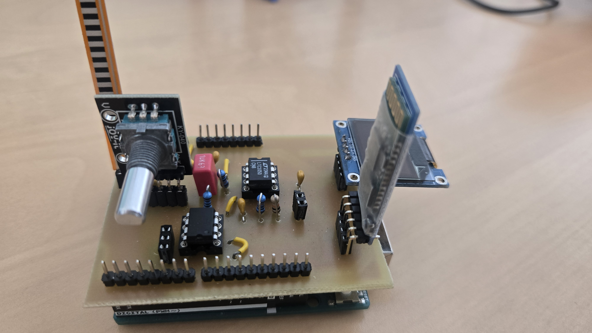

# 2025-2026-4GPa-CHAMBON-FORNS-GIRAUD
## SOMMAIRE
*** 
  - [I. Description Projet Graphite](#description-projet-graphite)
  - [II. Livrables](#livrables)
  - [III. Matériel nécessaire](#matériel-nécessaire)
  - [IV. Electronique Analogique sous LTSpice](#electronique-analogique-sous-ltspice)
  - [V. Création du PCB sous KiCad](#creation-du-pcb-sous-kicad)
  - [VI. Réalisation du shield](#réalisation-du-shield)
  - [VII. Code Arduino](#code-arduino)
  - [VIII. Application Android](#application-android)
  - [IX. Banc de test](#banc-de-test)
  - [X. Datasheet](#datasheet)
  - [XI. Conclusion](#conclusion)

*** 

## Description Projet Graphite

&nbsp;&nbsp;&nbsp;&nbsp;&nbsp;&nbsp; Dans le cadre de l’UE "Du capteur au banc de test" en 4e année de Génie Physique à l’INSA Toulouse, nous avons développé un capteur de contrainte basé sur une technologie low-tech. Ce capteur utilise du graphite déposé sur une feuille de papier à l’aide d’un crayon. Lorsque l'on applique une déformation au papier, la structure du graphite change, ce qui modifie ses propriétés électriques, comme la résistance. Ce capteur low-tech fonctionne grâce à la variation des connexions conductrices entre les nano-particules de graphite. Le transport des électrons se fait par effet tunnel entre les particules. Lorsqu'une déformation est appliquée, la distance entre les atomes varie. En extension, certains chemins de conduction sont interrompus, augmentant la résistance. En compression, la distance diminue, créant de nouveaux chemins et réduisant la résistance. La jauge de contrainte mesure ces variations de résistance pour déterminer la déformation et la contrainte appliquées. \
&nbsp;&nbsp;&nbsp;&nbsp;&nbsp;&nbsp; Le projet a consisté à développer un système complet autour de ce capteur : modélisation d'électronique analogique, création d’un circuit imprimé (PCB), programmation avec Arduino, ajout d’une interface utilisateur et communication sans fil via Bluetooth pour une application mobile. Un banc de test a été réalisé pour évaluer les performances du capteur à l'aide d'un banc de mesure réalisé en 3D. L’ensemble du travail a abouti à la rédaction d’une datasheet, décrivant les caractéristiques du capteur. Enfin, le projet visait à repondre à la question "Ce capteur est-il industrialisable ?", en comparaison avec les capteurs commerciaux déjà présents sur le marché.

## Livrables

  - Shield PCB compatible avec Arduino UNO, intégrant un capteur graphite, un amplificateur transimpédance, un module Bluetooth, un écran OLED, un flex sensor, un potentiomètre digital et un encodeur rotatoire;
  - Code Arduino assurant la lecture du capteur, l’affichage des données, la communication Bluetooth et l’interaction avec les composants;
  - Application Android réalisée sous MIT App Inventor pour visualiser les mesures transmises par Bluetooth;
  - Graphes caractéristiques de la variation de résistance du capteur graphène et du flex sensor, pour montrer les résultats obtenus sur le banc de test;
  - Datasheet du capteur de graphite, présentant ses principales caractéristiques et résultats expérimentaux.

## Matériel nécessaire

  - 1 carte Arduino Uno
  - 2 Résistances de 100kΩ
  - 1 Résistance de 1kΩ
  - 1 Potentiomètre digital MCP-41050
  - 2 Condensateurs 100nF
  - 1 Condensateur 1µF
  - 1 Amplificateur LTC1050
  - 1 Écran OLED01
  - 1 Module Bluetooth HC-05
  - 1 Encodeur rotatoire 

## Electronique Analogique sous LTSpice

Notre capteur en graphite présente une résistance de l’ordre du gigaOhm, ce qui génère un courant de quelques pico à nano Ampères sous une tension de 5 V. Pour rendre ce signal exploitable par l’ADC d’une Arduino UNO, nous avons conçu un amplificateur transimpédance autour de l’AOP LTC1050, il a une très faible dérive et un excellent décalage d’offset. Après avoir modélisé le capteur et le montage sous LTspice pour de déterminer la meilleure valeur de la résistance de rétroaction, nous avons ajouté trois étages de filtrage afin d'améliorer la qualité du signal :  
   1- Filtre passe-bas pour éliminer les hautes fréquences parasites,  
   2- Filtre passe-bas pour atténuer le bruit secteur à 50 Hz,  
   3- Filtre passe-bas pour supprimer les interférences liées à l’ADC.  

Ce circuit convertit ainsi le faible courant issu du capteur en une tension propre, directement lisible et traitable par la carte Arduino.

 
<i>Circuit amplificateur transimpédance</i>

## Création du PCB sous KiCad

Lors de la phase de conception du shield, nous avons d’abord repris le gabarit d’une carte Arduino UNO dans KiCad (version 8.0) pour garantir une compatibilité mécanique et électrique. Après avoir listé tous les éléments dont nous avions besoin, nous avons créé dans KiCad, les symboles et empreintes manquants en respectant leurs dimensions et l’écartement des broches. Voici le schéma électrique de l'ensemble de notre montage :

 
<i>Circuit électronique</i>

Une fois notre bibliothèque faite, nous avons assemblé le schéma électrique complet : chaque composant est relié selon le fonctionnement prévu. Cette étape nous a permis de vérifier que l’ensemble des composants tenait bien sur la zone réservée au Shield. En passant à la vue PCB, nous avons effectué le routage des pistes dans le but d'une organisation optimale puis ajouté un plan de masse pour relier les pistes au GND. 
Voici notre PCB :

 
<i>PCB</i>

Le résultat est un circuit imprimé prêt à être fabriqué et à recevoir chaque composant sur le shield Arduino UNO.

## Réalisation du Shield

Nous avons commencé par l’édition du masque de gravure de notre circuit imprimé (PCB) à l’aide du logiciel KiCad. Ensuite, nous avons procédé à l’insolation UV d’une plaquette d’époxy recouverte d’une fine couche de cuivre et de résine photosensible. La plaquette a ensuite été immergée dans un révélateur chimique, ce qui permet d’éliminer la résine non exposée aux UV. Il faut ensuite plonger la plaquette dans du perchlorure de fer pour graver les pistes du circuit en dissolvant le cuivre non protégé. Enfin, il faut un nettoyage à l’acétone pour retirer les résidus de résine restants sur la plaquette. A la fin de ce travail, nous avions notre circuit imprimé avec toutes les pistes tracées. 
Une fois le PCB réalisé, nous n'avions plus qu'à le percer et y souder tous nos composants. Voici notre PCB final :

 
<i>Notre PCB</i>

## Code Arduino 

Ce projet a été piloté par un [programme Arduino](Code%20Arduino). Pour utiliser les fonctions spéciales à tous les composants, nous avons installé les librairies Adafruit_SSD1306.h , SPI.h , et SoftwareSerial.h.

Le programme permet d'initialiser et de paramétrer nos composants pour le bon fonctionnement du circuit. Une fois la carte mise sous tension, l'écran OLED affiche 4 possibilités sélectionnables grâce à l'encodeur rotatoire : 
- "Calib Potar" permettant de définir la valeur de la résistance du potentiomètre (notée R2 dans notre montage et notre code)
- "FlexSensor" pour réaliser une mesure momentanée de résistence du flex sensor
- "Capteur Graph" dans le but d'afficher la mesure de résistance sur le capteur graphène
- "Bluetooth" afin d'envoyer des mesures toutes les 2 secondes à l'application Androïd, permettant de modifier la courbure du capteur graphène et d'en remarquer la variation de résistance

Chaque possibilité est piloté par des fonctions indépendantes les unes des autres.

## Application Android

Nous avons conçu une application Android en utilisant la plateforme MIT App Inventor. Cette application permet de recevoir les données de la carte Arduino via une connexion Bluetooth en utilisant le module HC-05 qui se trouve sur notre shield. Après la connexion bluetooth, l'application nous donne en temps réel la valeur de la résistance du capteur graphite et trace sa courbe en fonction du temps sur un graphique. Vous la trouverez [Application MIT_App_Inventor](https://github.com/CamilleChambon/2025-2026-4GPa-CHAMBON-FORNS/tree/main/Application%20MIT_App_Inventor).

## Banc de test

Après avoir réalisé le montage électrique complet, ainsi que les parties softwares adéquates, il était nécessaire de tester notre capteur ainsi que le capteur commercial pour pouvoir les comparer. 

Pour cela, nous avons utilisé le banc de test ci-dessous, constitué de 6 cylindres différents dont les diamètres D font 14,8 mm ; 19,8 mm ; 24,8 mm ; 29,8 mm ; 34,8 mm ; 39,8 mm.

 
<i>Banc de test utilisé</i>

Pour toutes les mesures, nous avons assigné une valeur de 10 kΩ à la résistance du potentiomètre digital. En ce qui concerne le capteur graphène, nous déposions le graphite issu des crayons 6B, 3B, et B. Nous n'avons pas réussi à obtenir des valeurs convenables avec des crayons plus durs. 

Le principe du test est de poser le capteur sur le cylindre et de le tordre selon la courbure du cylindre. Une fois le capteur bien posé, nous relevons la valeur de la résistance. 

Pour nos calculs, les valeurs qui nous intéressent sont la variation relative de résitance ()
en fonction de la déformation (). 

Voici les courbes caractéristiques du capteur graphène, en tension et en compression : 

 

 

Et ci-dessous la caractéristique du flex sensor en tension : 

 

Nous remarquons que la résistance évolue lorsque le capteur graphite est soumis à une déformation. En tension, la résistance augmente, tandis qu'en compression, elle diminue. Ce phénomène s'explique par le rapprochement des atomes lors de la compression, facilitant ainsi le passage du courant. Lors de la tension, les atomes s'éloignent, le courant a alors plus de mal pour passer. Les résultats montrent aussi que le type de crayon utilisé influence les valeurs de résistance mesurées. 

La capacité de déformation en compression du capteur graphène n'est pas très fiable selon nos résulats. Le modèle linéaire attendu s'éloigne de la caractéristique sur les grosses déformations. Ceci peut être en partie dû au frottement du graphite sur le banc de test, qui peut perturber l'agencement des atomes et ainsi les mesures réalisées. 

Ces résultats expérimentaux permettent de conclure que le capteur commercial est globalement plus sensible à la déformation que les capteurs en graphite, même si cette dernière est acceptable. De plus, il possède une certaine robustesse contrairement aux capteurs en papier : ceux-ci sont fragiles et n'importe quel contact peut altérer le gtaphite déposé. Le nombre d'utilisation est aussi limité, entre 1 et 3 séries de tests pour la plupart. Au-delà, les variations de résistance étaient très aléatoires et parfois inexistantes. Il était également nécessaire de déposer une grande quantité de graphite sur le papier pour pouvoir mesurer une résistance, notamment avec des crayons bien gras. 

## Datasheet

La datasheet de notre capteur est disponible [ici](Datasheet).

## Conclusion

Grâce à la série d'étapes amenant aux tests réalisés sur les deux capteurs, nous pouvons répondre à la question, à savoir si le capteur graphène est industrialisable ou non. 

Comme mentionnés dans la partie [IX. Banc de test](#banc-de-test), les résultats montrent que le capteur commercial possède plusieurs avantages par rapport au capteur graphène. Il est plus fiable, plus durable, et moins contraignant, ce qui nous amène à être réticents à l'idée de commercialiser notre capteur. Toutefois, sa sensibilité est plus qu'acceptable, et il est capable de mesurer en compression. Pour une utilisation unique et rapide, il reste une belle option. Si nous améliorions sa capacité de compression (en protégeant le graphite par un gel par exemple), il deviendrait une solution de choix. Mais cette solution est avant tout low tech, il faudrait donc rester acessible. 

Ce projet fût très enrichissant, il nous a permis de concevoir la partie software et hardware d'un capteur, tout en le testant et réalisant une datasheet. Les différentes étapes nous ont fait acquérir de nouvelles connaissances et compétances que nous retrouverons probablement dans notre future carrière d'ingénieur physicien. Nous remercions nos professeurs pour nous avoir proposé ce projet et accompagné tout au long de celui-ci. 

Vous pouvez nous contacter si vous avez la moindre question :
- Timothy FORNS : forns@insa-toulouse.fr
- Camille CHAMBON : chambo@insa-toulouse.fr
